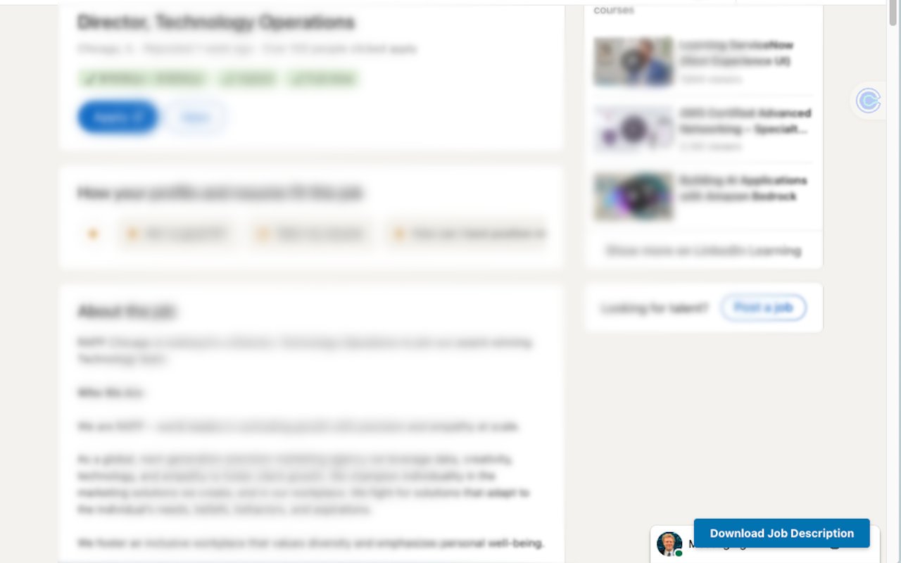

# LinkedIn Job Downloader

A Chrome extension that saves LinkedIn job descriptions as clean, styled HTML files with one click.



## Features

- **One-click download** -- a floating button appears on LinkedIn job pages
- **Complete extraction** -- captures job title, company, location, salary, work type, job type, posting date, and applicant count
- **Styled HTML output** -- files look great in any browser and print well
- **Smart file naming** -- saved as `Company-Position.html` for easy organization
- **Privacy focused** -- everything stays local, nothing is uploaded or shared
- **Zero dependencies** -- pure vanilla JavaScript, no build step

## Install

### From source (developer mode)

1. Clone this repo
2. Open `chrome://extensions` in Chrome
3. Enable **Developer mode** (toggle in the top right)
4. Click **Load unpacked** and select the `linkedin-job-saver/` directory
5. Navigate to any LinkedIn job listing -- you'll see a blue **Download Job Description** button in the bottom right

### From the Chrome Web Store

*(Coming soon)*

## How it works

1. Visit any LinkedIn job listing (`linkedin.com/jobs/view/...`)
2. Click the blue **Download Job Description** button in the bottom right corner of the page (or use the extension popup)
3. An HTML file is saved to your downloads folder with all the job details

The extension automatically expands truncated job descriptions before extraction.

## Architecture

```
linkedin-job-saver/
  manifest.json    -- Chrome Extension Manifest V3
  content.js       -- Injected into LinkedIn pages; extracts job data from the DOM
  background.js    -- Service worker; generates styled HTML and triggers downloads
  popup.js         -- Extension popup UI logic
  popup.html       -- Popup interface
  icons/           -- Extension icons (16, 48, 128px)
```

**Selector resilience** -- LinkedIn frequently renames CSS classes. All DOM selectors are centralized in a `SELECTORS` config object at the top of `content.js`, using partial class matching, `aria` attributes, and structural patterns to survive renames. When LinkedIn changes their DOM, update this one object.

## Permissions

| Permission | Why |
|---|---|
| `activeTab` | Access the current LinkedIn job page |
| `downloads` | Save the HTML file |
| `storage` | Cache job metadata per tab |
| `tabs` | Detect when a job page is loaded |
| `https://www.linkedin.com/jobs/*` | Only activates on LinkedIn job pages |

No data is collected, shared, or sent anywhere.

## Contributing

1. Fork the repo
2. Make your changes
3. Test by loading the unpacked extension in Chrome
4. Submit a PR

When updating selectors for LinkedIn DOM changes, edit the `SELECTORS` object at the top of `content.js` -- avoid scattering selectors throughout the code.

## License

MIT
